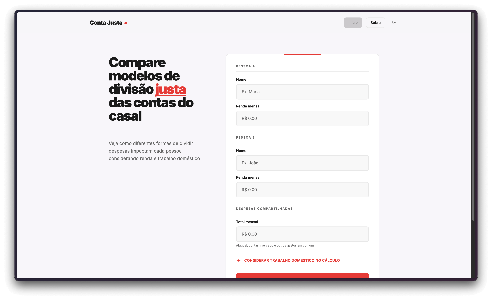

# Conta Justa

Calculadora de divisão justa de despesas para casais, considerando renda e trabalho doméstico.



## Sobre

O Conta Justa é uma calculadora gratuita que ajuda casais a comparar modelos de divisão de despesas, considerando a renda e o trabalho doméstico de cada pessoa.

Diferente de outras ferramentas, reconhecemos que contribuir vai além do dinheiro. As horas dedicadas a tarefas domésticas — uma contribuição econômica real que costuma ser invisível — também entram no cálculo.

## Funcionalidades

- Compare dois modelos de divisão: proporcional (por renda) e igual (50/50)
- Inclua horas de trabalho doméstico para uma visão mais completa
- Visualize o impacto de cada modelo em tempo real
- Responsivo para qualquer dispositivo
- Tema claro e escuro

## Stack

- **Framework**: TanStack Start (full-stack React 19)
- **Formulários**: TanStack Form
- **Estilos**: Tailwind CSS v4
- **Estado**: Zustand
- **Testes**: Vitest + Playwright
- **Linting**: Biome
- **Analytics**: PostHog
- **Deploy**: Vercel

## Estrutura do Projeto

```
src/
  components/
    app/        # Componentes da aplicação (formulário, resultados, hero)
    layout/     # Componentes de layout (header, footer)
    ui/         # Primitivos reutilizáveis (button, input, card)
  hooks/        # Hooks customizados
  lib/          # Funções utilitárias e cálculos
  providers/    # Context providers (PostHog, tema)
  routes/       # Rotas baseadas em arquivo (TanStack Router)
  schemas/      # Schemas de validação (Zod)
  server/       # Funções server-side
  stores/       # Stores de estado (Zustand)
tests/
  e2e/          # Testes E2E (Playwright)
```

## Design System

### Cores

- **Brand**: Escala de cores primárias para ações e destaques
- **Base**: Escala neutra para backgrounds e elementos secundários
- Todas as combinações de cores mantêm contraste WCAG 2.1 AA (>= 4.5:1)

### Acessibilidade

- HTML semântico em toda a aplicação
- Acessível via teclado
- Indicadores de foco visíveis em elementos interativos
- Atributos ARIA em componentes customizados
- Contraste de cores adequado nos temas claro e escuro

## Licença

MIT
